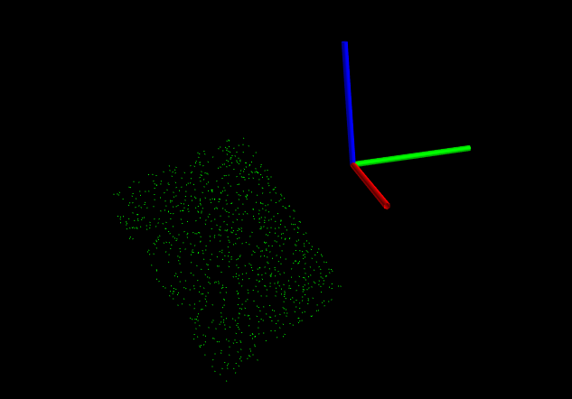
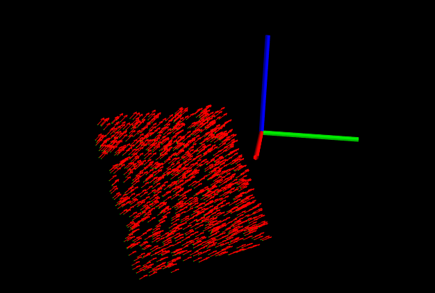
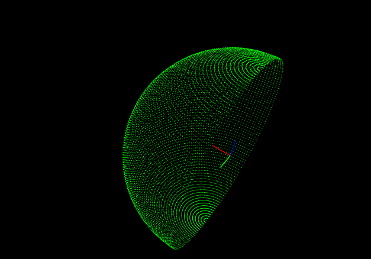
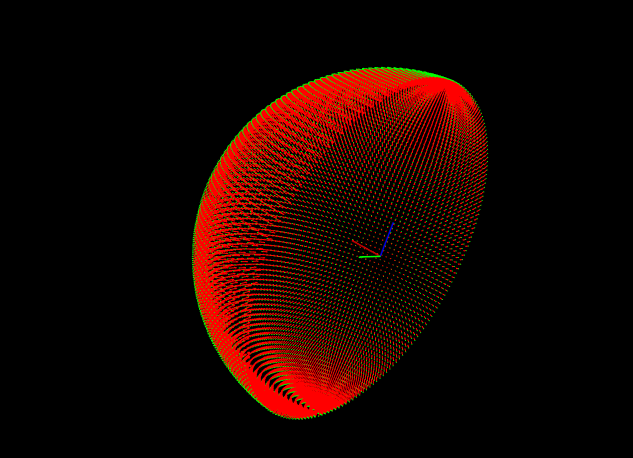
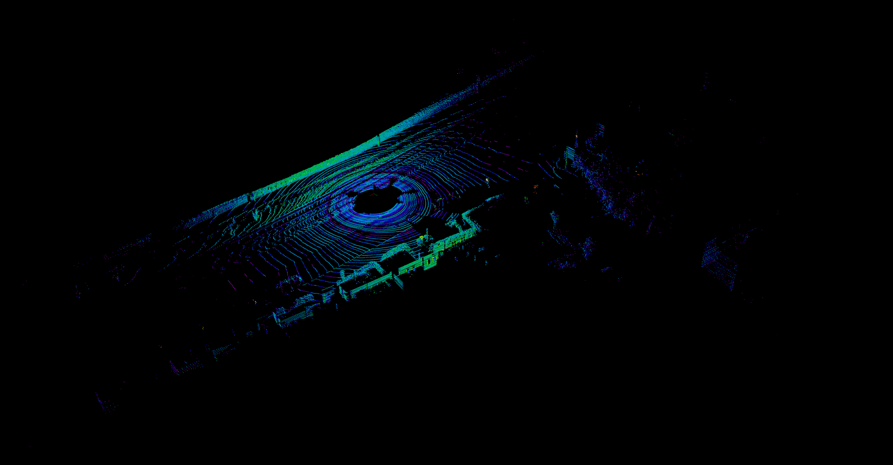
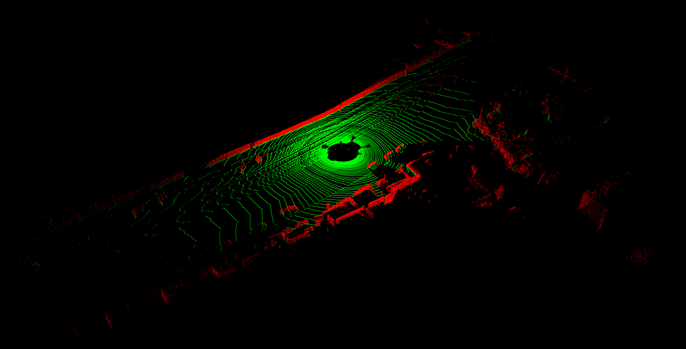
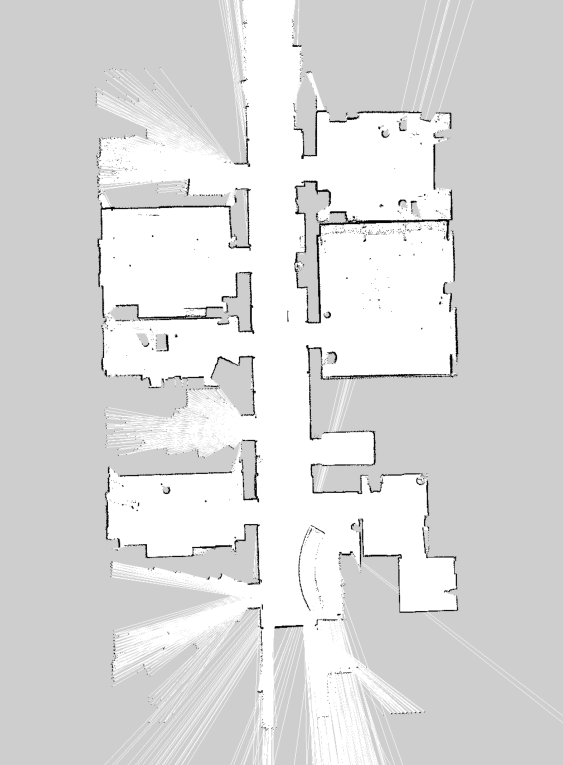
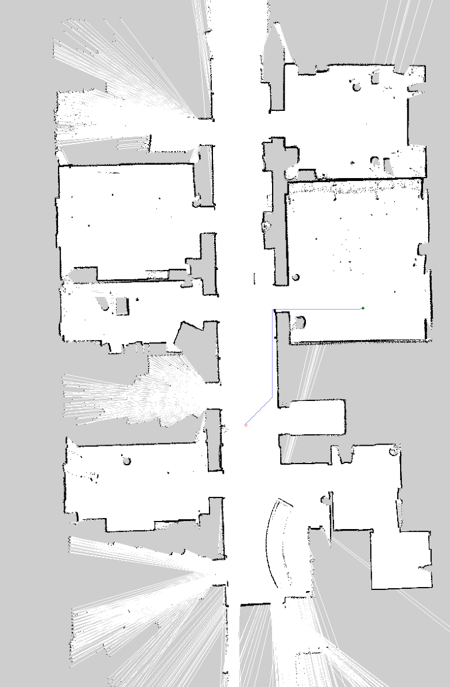
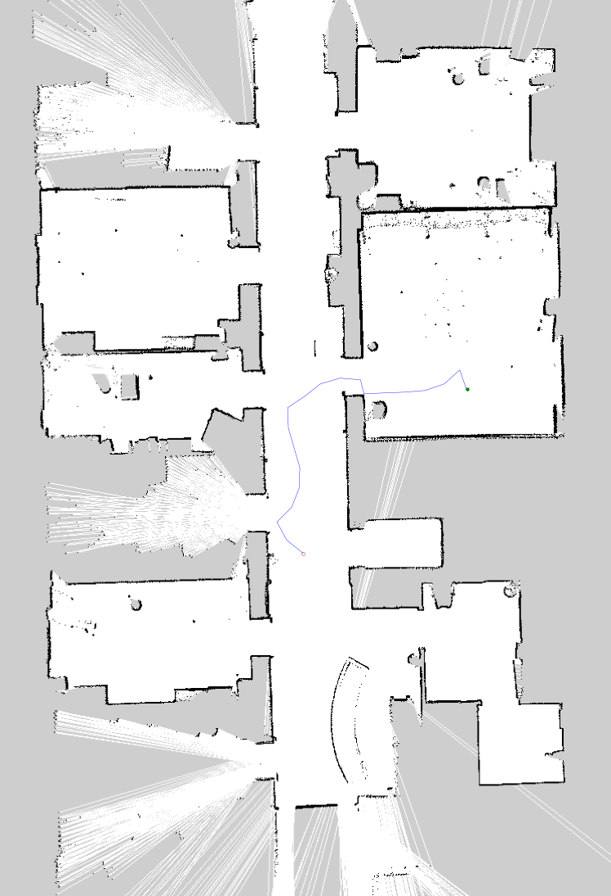

RoboHub is a collection of C++ implementations of algorithms used in robotics

## Build and run content
### 1. Using docker (Recommended)
``` bash
# build content
$ ./docker_build.sh
# run docker interactvely
$ ./docker_run.sh
```
All the built content can be found in `/workspace/build/` directory when the docker terminal is up

### 2. Native build (dependencies might need to be installed separately)
``` bash
$ mkdir build && cd build
$ cmake ..
$ make
```
## Details

1. Currently this project doesn't use any of the pcl or ROS components. All imlementations are primarily based on STL and Eigen. Data generations and visualization for tests is made with python scripts (can be found in the `scripts` directory) that use `numpy` and `matplotlib` for 2d and `mayavi` for 3d visualizations

2. API is header only. Implementations can be found in `include` directory

3. All functionaly can be qualitatively and/or quantitatively tested using provided tests found in `tests` directory  

Refer to [docs](./docs/html/index.html) for implementation and API details (__NOTE__: open file in browser - docs/html/index.html)

### Running tests

Tests are provided as .sh files in `scripts` directory  
``` bash
$ cd scripts
```

1. __Test normal estimation__   
``` bash
$ ./test_normal_estimation.sh
```
|            |            |
| :------------------------------------------: | :---------------------------------------------------: |
|  |  |

2. __Test plane extraction__  
Input data for this test is taken from KITTI dataset
``` bash
$ ./test_plane_extraction.sh
```
|  |  |
| :--------------------------------------------: | :--------------------------------------: |

3. __Test A* planner__  
Input map for this test is taken from [here](https://github.com/zkytony/graphspn/tree/master/graphspn/experiments/dataset/cold-groundtruth/Stockholm/groundtruth/floor4)  
``` bash
$ ./test_astar.sh
```
|  |  |
| :---------------------: | :-------------------------------------------: |

4. __Test RRT planner__    
``` bash
$ ./test_rrt.sh
```
|  |  |
| :---------------------: | :-----------------------------------------: |

### TO-DO  

- [ ] RRT planner has still some issues, it is not generating consistent paths all the time. Need to implement RRT* which leads to more straighter and practical paths

- [ ] Map in planner is being direclty used, cost values need to be diffused to account for safe distances and obstacle & robot footprints

- [ ] Bidirectional RRT 